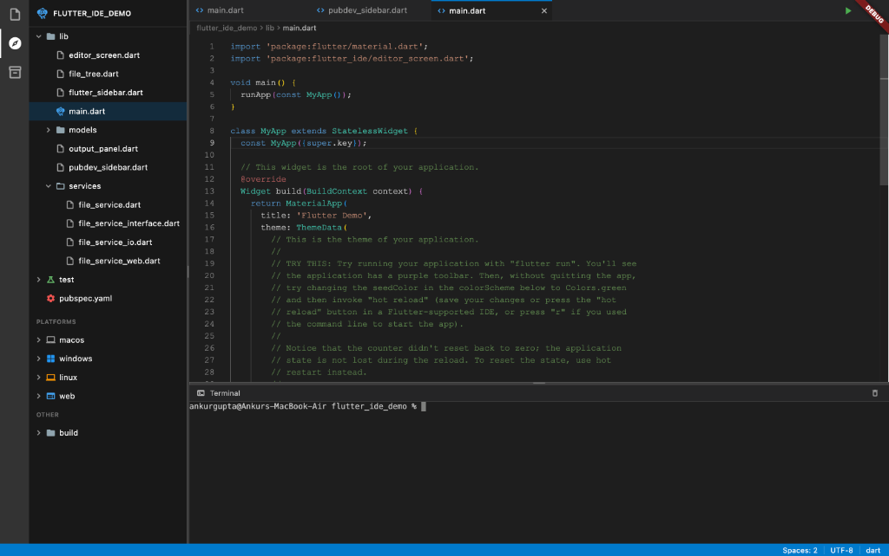
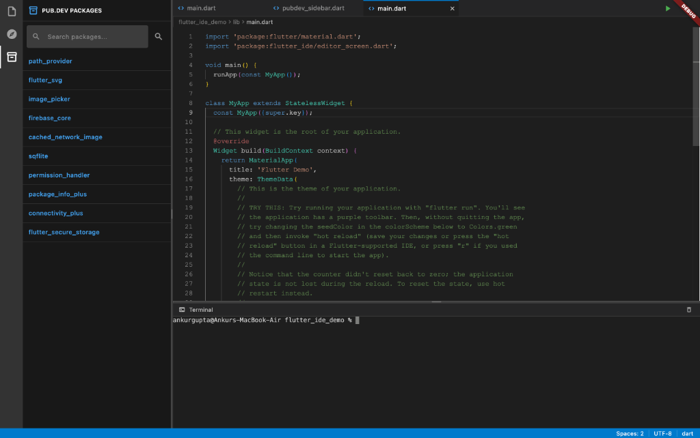
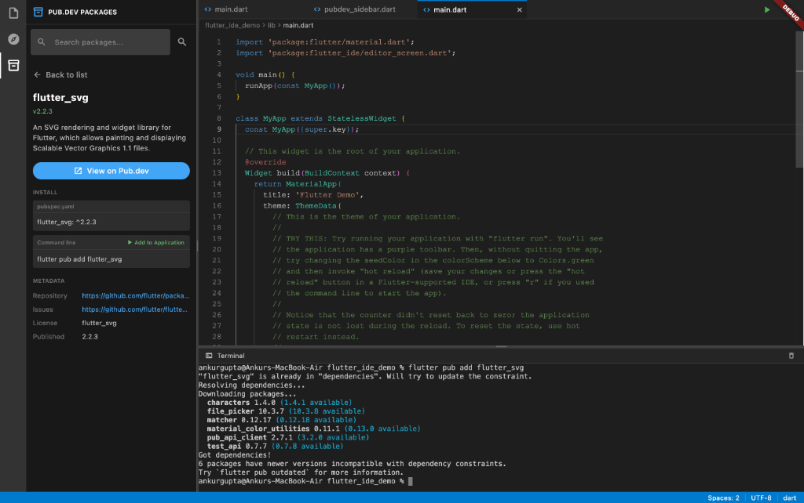
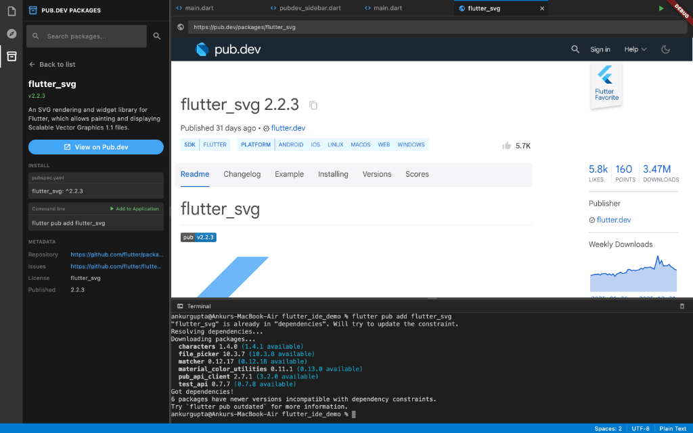

# Flutter IDE

A lightweight, cross-platform code editor built with Flutter. Features a VS Code-inspired interface with Monaco Editor integration, file tree navigation, multi-tab editing, integrated terminal, and pub.dev package search.

## Features

### Editor
- **Monaco Editor** - Powered by `flutter_monaco` for a rich code editing experience with syntax highlighting
- **Multi-Tab Editing** - Open and switch between multiple files with a tabbed interface
- **Auto-Save** - Automatically saves changes every 2 seconds
- **File Watching** - Detects external file changes and reloads content automatically
- **Quick File Search** - Press `Cmd+P` to quickly search and open files
- **Syntax Highlighting** - Supports multiple languages:
  - Dart, JavaScript, TypeScript, HTML, CSS, JSON, YAML, Markdown, SQL, XML

### Sidebars
- **File Explorer** - VS Code-style sidebar with collapsible folder tree navigation
- **Flutter Project View** - Organized view showing lib, test, platforms, and other folders
- **Pub.dev Package Search** - Search and browse pub.dev packages with:
  - Popular packages display
  - Package details and metadata
  - One-click "Add to Application" to run `flutter pub add`
  - Open package pages in embedded WebView tabs

### Terminal
- **Integrated Terminal** - Full PTY-based terminal with xterm.js
- **Run Commands** - Execute `flutter run`, `flutter pub get`, and other commands
- **Resizable Panel** - Drag to resize the terminal height
- **Global Command API** - Run terminal commands from anywhere using `runTerminalCommand()`

### WebView Tabs
- **Embedded Browser** - Open web pages (pub.dev, GitHub, docs) in editor tabs
- **Link Interception** - Links clicked in WebViews open in new tabs

### UI/UX
- **Resizable Sidebar** - Drag to adjust sidebar width (150px - 500px)
- **Resizable Terminal** - Drag to adjust terminal height (100px - 500px)
- **Dark Theme** - Modern VS Code-inspired dark UI
- **Cross-Platform** - Runs on macOS, Windows, Linux, iOS, and Android

## Screenshots

### Main IDE Interface


### Pub.dev Package Search


### Package Details View


### Package Documentation



The editor features:
- Activity bar (left) for switching between Explorer, Flutter View, and Pub.dev
- Resizable file explorer sidebar with folder/file tree
- Editor tabs with file icons and WebView tabs
- Breadcrumb navigation
- Integrated terminal panel
- Status bar showing language, encoding, and indentation

## Getting Started

### Prerequisites

- Flutter SDK ^3.10.1
- Dart SDK ^3.10.1

### Installation

1. Clone the repository:
   ```bash
   git clone <repository-url>
   cd flutter_ide
   ```

2. Navigate to the demo project:
   ```bash
   cd flutter_ide_demo
   ```

3. Install dependencies:
   ```bash
   flutter pub get
   ```

4. Run the application:
   ```bash
   # For desktop (recommended)
   flutter run -d macos  # or windows, linux

   # For mobile
   flutter run -d <device-id>
   ```

## Project Structure

```
flutter_ide_demo/
├── lib/
│   ├── main.dart                 # App entry point
│   ├── editor_screen.dart        # Main editor UI with Monaco integration
│   ├── file_tree.dart            # File explorer tree widget
│   ├── flutter_sidebar.dart      # Flutter project structure sidebar
│   ├── pubdev_sidebar.dart       # Pub.dev package search sidebar
│   ├── output_panel.dart         # Integrated terminal panel
│   ├── models/
│   │   └── file_system_entity.dart   # File/Directory node models
│   └── services/
│       ├── file_service.dart         # Platform-aware service factory
│       ├── file_service_interface.dart   # Abstract file service
│       ├── file_service_io.dart      # Native platform implementation
│       └── file_service_web.dart     # Web platform implementation
├── pubspec.yaml
└── test/
```

## Architecture

### File System Abstraction

The app uses a platform-aware file service pattern:

- `FileService` (interface) - Defines operations: `pickDirectory`, `readFile`, `createFile`, `createDirectory`, `saveFile`, `deleteFile`, `deleteDirectory`, `rename`
- `FileServiceIO` - Implementation for native platforms (macOS, Windows, Linux, iOS, Android)
- `FileServiceWeb` - Implementation for web browsers using File System Access API

### Global Terminal API

Run terminal commands from anywhere in the app:

```dart
import 'editor_screen.dart';

// Execute any command
runTerminalCommand('flutter run');
runTerminalCommand('flutter pub get');
runTerminalCommand('dart analyze');
```

### Data Models

- `FileNode` - Abstract base class for file system entities
- `FileNodeDirectory` - Represents a folder with children
- `FileNodeFile` - Represents a file with optional cached content
- `WebTab` - Represents a WebView tab with title and URL

## Dependencies

| Package | Version | Purpose |
|---------|---------|---------|
| `flutter_monaco` | ^1.1.1 | Monaco Editor integration |
| `file_picker` | ^10.3.7 | Native file/folder selection |
| `path` | ^1.9.1 | Path manipulation utilities |
| `path_provider` | ^2.1.5 | Platform-specific directories |
| `webview_flutter` | ^4.10.0 | WebView for embedded browser |
| `xterm` | ^4.0.0 | Terminal emulator UI |
| `flutter_pty` | ^0.4.0 | PTY for terminal functionality |
| `pub_api_client` | ^2.5.0 | Pub.dev API client |
| `http` | ^1.2.0 | HTTP client |

## Usage

1. **Open a Folder** - Click "Open Folder" on the welcome screen or use the folder icon
2. **Navigate Files** - Click folders to expand/collapse, click files to open in editor
3. **Quick Open** - Press `Cmd+P` to search for files by name
4. **Edit Code** - Changes are auto-saved every 2 seconds
5. **Create Files/Folders** - Use the icons in the explorer header
6. **Switch Views** - Use the activity bar to switch between Explorer, Flutter View, and Pub.dev
7. **Search Packages** - Use the Pub.dev sidebar to search and add packages
8. **Run App** - Click the green play button to run `flutter run`
9. **Use Terminal** - Toggle terminal visibility and run commands

## Keyboard Shortcuts

| Shortcut | Action |
|----------|--------|
| Cmd/Ctrl + P | Quick file search |
| Cmd/Ctrl + O | Open folder |
| Cmd/Ctrl + N | New file |
| Cmd/Ctrl + Click | Go to definition (placeholder) |

## Recent Changes

- Added integrated terminal with PTY support
- Added pub.dev package search sidebar
- Added WebView tabs for opening URLs in editor
- Added file watching for external changes
- Added resizable sidebar and terminal panels
- Added Quick File Search (Cmd+P)
- Added Flutter project sidebar view
- Added Run button to execute `flutter run`
- Added global `runTerminalCommand()` API
- Added protection against accidental empty file saves

## Roadmap

- [x] Terminal panel
- [x] Pub.dev integration
- [x] WebView tabs
- [x] File watching
- [x] Resizable panels
- [x] Command+P and Command+O to search files and open folder.
- [ ] LSP (Language Server Protocol) integration for Dart
- [ ] Search across files
- [ ] Git integration
- [ ] Extensions support
- [ ] Custom themes
- [ ] Split editor views

## Contributing

Contributions are welcome! Please feel free to submit a Pull Request.

## License

This project is open source and available under the MIT License.
